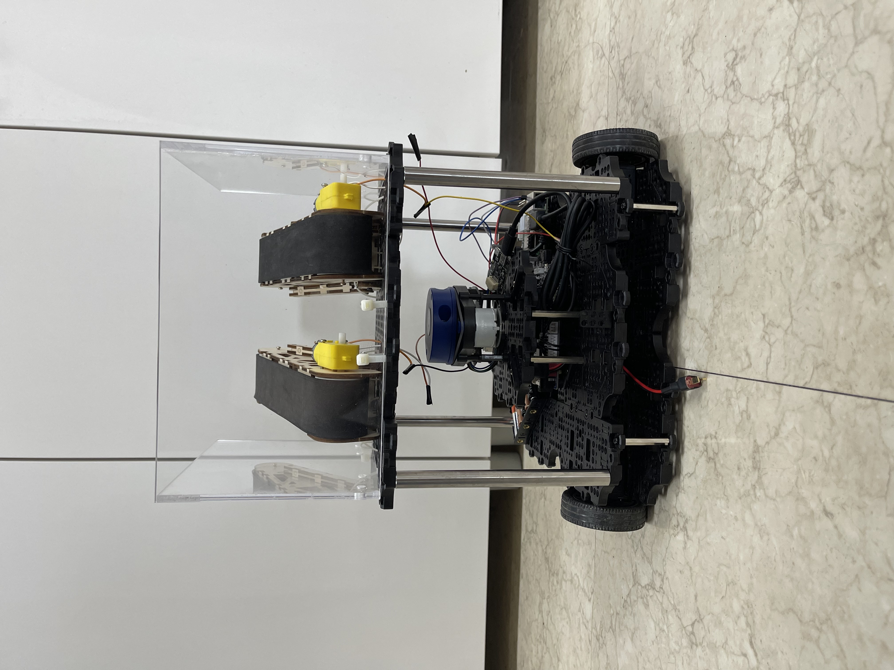
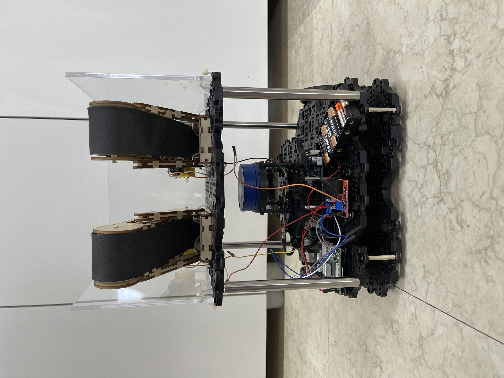
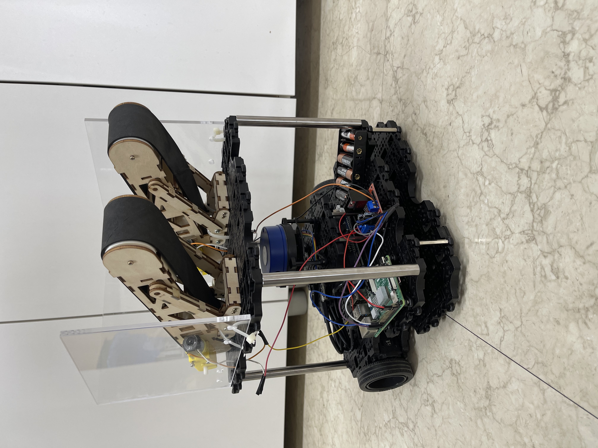
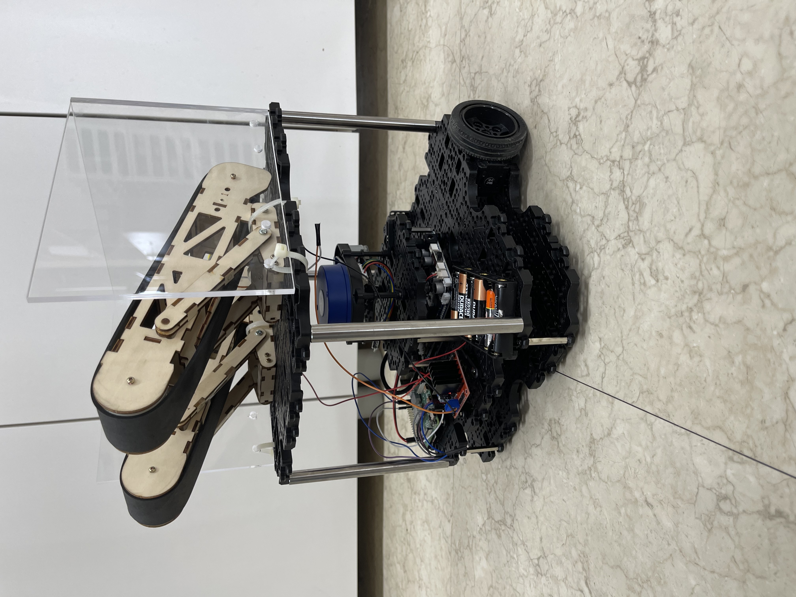
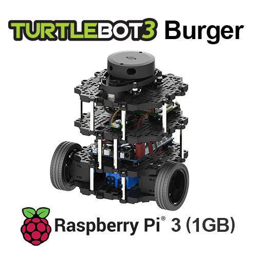
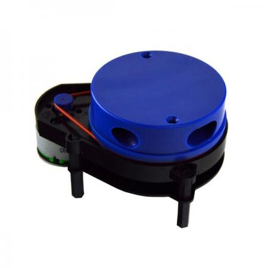
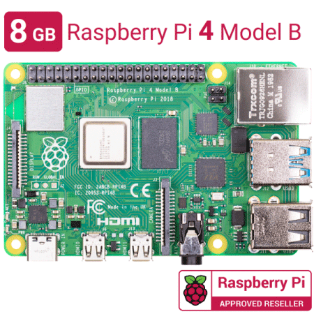
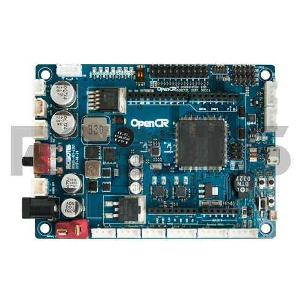
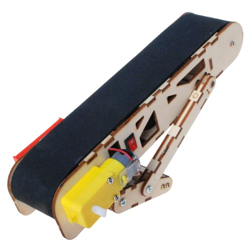
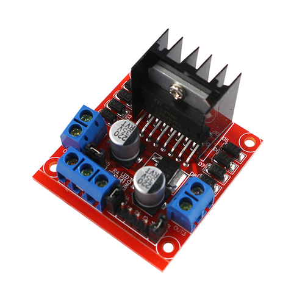

# Robot Hardware Assembly 
## 로봇 하드웨어 구성
---
## 로봇 사진

전면

후면

측면

---

## 주요 구성품

[Turtlebot3 Burger (Store)](https://www.robotis.com/shop/item.php?it_id=901-0118-200)

[YDLIDAR X4 (Store)](https://www.devicemart.co.kr/goods/view?no=12553062)

[Raspberry Pi 4 Model B (Store)](https://www.devicemart.co.kr/goods/view?no=12553062)

[OpenCR 1.0 (Store)](https://www.robotis.com/shop/item.php?it_id=903-0257-000)

[컨베이어 벨트 (Store)](http://ideaplay6173.cafe24.com/product/detail.html?product_no=371&cate_no=47&display_group=1)

[모터 드라이버 2A L298N (Store)](https://eduino.kr/product/detail.html?product_no=194&cate_no=55&display_group=1)

