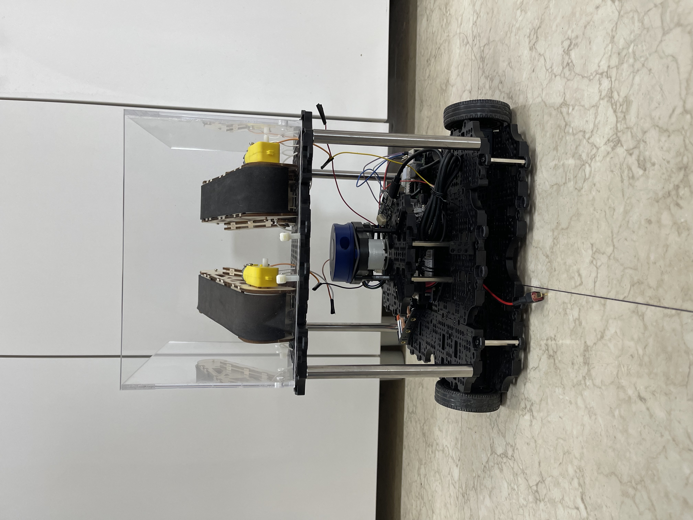
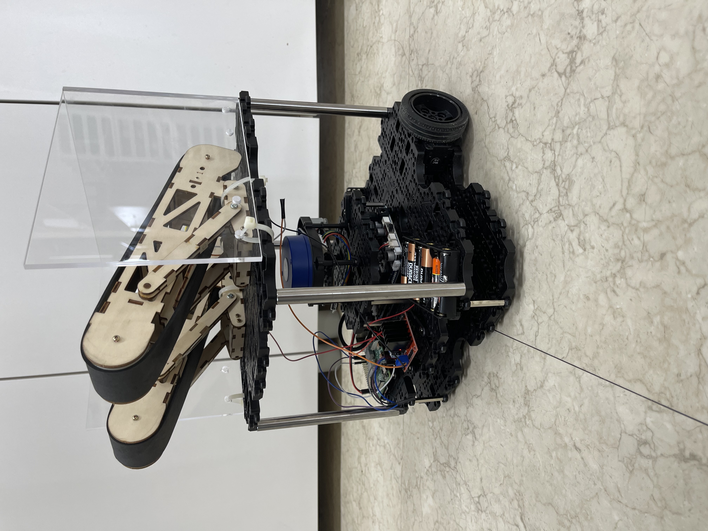
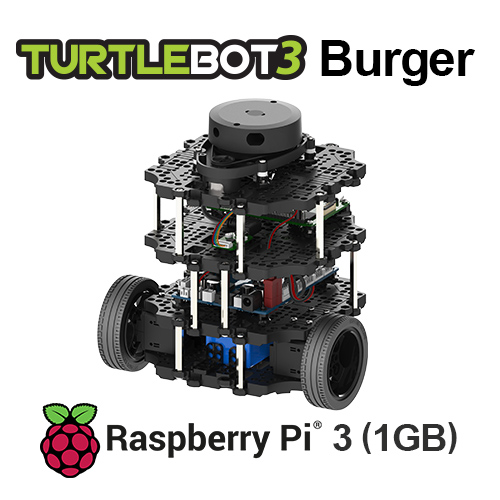
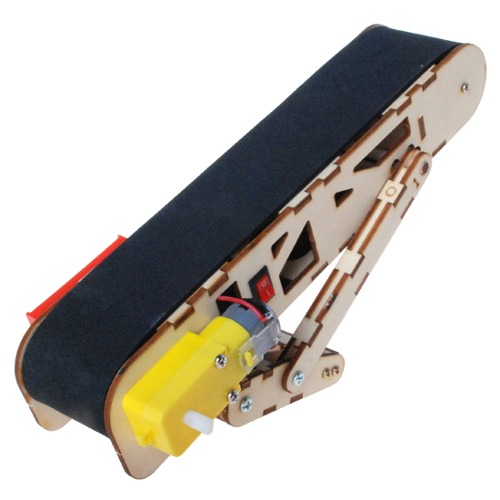
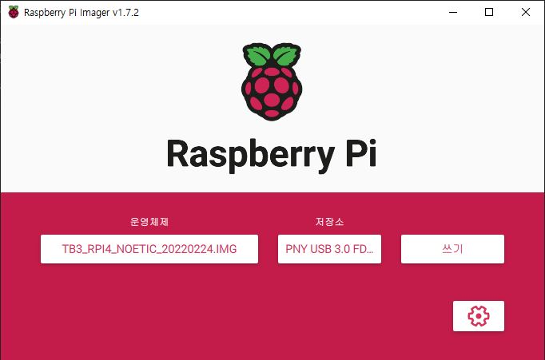
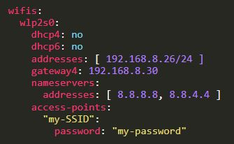
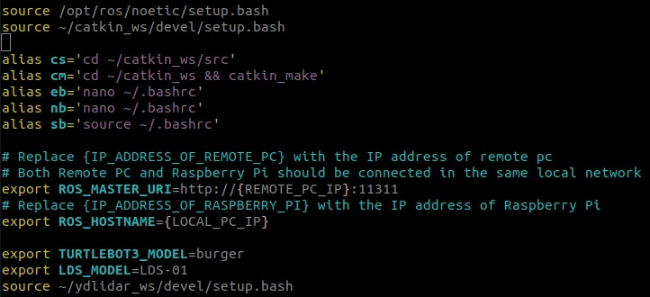

# Robot Hardware Assembly 
## 로봇 하드웨어 구성

## 로봇 사진
<details>
<summary>전면</summary>


</details>

<details>
<summary>후면</summary>


</details>

<details>
<summary>측면</summary>



</details>

## 주요 구성품



[Turtlebot3 Burger (Store)](https://www.robotis.com/shop/item.php?it_id=901-0118-200)


[YDLIDAR X4 (Store)](https://www.devicemart.co.kr/goods/view?no=12553062)


[Raspberry Pi 4 Model B (Store)](https://www.devicemart.co.kr/goods/view?no=12553062)


[OpenCR 1.0 (Store)](https://www.robotis.com/shop/item.php?it_id=903-0257-000)



[컨베이어 벨트 (Store)](http://ideaplay6173.cafe24.com/product/detail.html?product_no=371&cate_no=47&display_group=1)


[모터 드라이버 2A L298N (Store)](https://eduino.kr/product/detail.html?product_no=194&cate_no=55&display_group=1)

## Raspberry Pi 용 ROS 이미지 부팅 및 기본 설정

* [Raspberry Pi 4 ROS Noetic 이미지 다운로드](https://www.robotis.com/service/download.php?no=2066)

* [Raspberry Pi Imager 다운로드](https://www.raspberrypi.com/software/) <br>

* microSD 카드에 이미지 Write 이후 RPI에 장착/부팅<br>


* RPI에 모니터 연결  **( ID :ubuntu, password: turtlebot )**


*   ```bash
    $ cd /etc/netplan
    $ sudo vim 50-cloud-init.yaml
    ```
* 아래 예시와 같이 작성 **( "my-SSID" : 연결할 WIFI이름(SSID), "my-password" : 연결할 WIFI 의 비밀번호 )** <br>


* `sudo netplan apply` 또는 `sudo reboot now`

*   ```bash
    $ ifconfig # ip확인
    $ vim ~/.bashrc
    ```
* 아래 그림과 같이 작성 **( {Remote_PC_IP}: 로봇 서버 ip, {LOCAL_PC_IP}: RPI ip )** <br>


## OpenCR 설정

RPI 에서 실행.

```bash
$ sudo dpkg --add-architecture armhf
$ sudo apt-get update
$ sudo apt-get install libc6:armhf

$ export OPENCR_PORT=/dev/ttyACM0
$ export OPENCR_MODEL=burger_noetic
$ rm -rf ./opencr_update.tar.bz2

$ wget https://github.com/ROBOTIS-GIT/OpenCR-Binaries/raw/master/turtlebot3/ROS1/latest/opencr_update.tar.bz2 
$ tar -xvf opencr_update.tar.bz2 

$ cd ./opencr_update
$ ./update.sh $OPENCR_PORT $OPENCR_MODEL.opencr
```
아래 처럼 나오면 성공<br>
