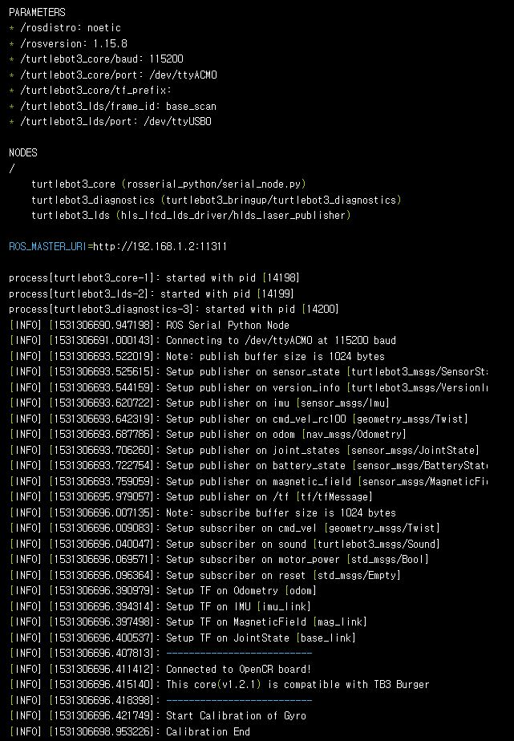
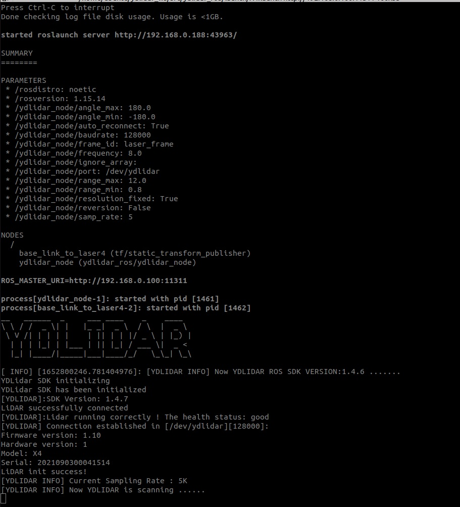

# Robot-Side(Local) Application
## 로봇 실행 어플리케이션

## 로봇 실행 명령어

로봇이 서버와 통신 하기위해서 실행 **(turtlebot3_bringup)**
```bash
$ ssh ubuntu@{IP_ADDRESS_OF_RASPBERRY_PI} # 로봇 서버에서 원격으로 실행시 SSH접속

$ roslaunch turtlebot3_bringup turtlebot3_robot.launch
```
아래 예시와 같이 나오면 성공<br>


라이더 사용과 메세지를 받기위해서 실행
```bash
$ roslaunch ydlidar_ros X4.launch
or
$ roslaunch ydlidar_ros_driver X4.launch
```
아래 예시와 같이 나오면 성공<br>


## 캐리어 동작 서버 실행 명령어

캐리어는 로봇 로컬에서 동작을 하기 때문에 원격지의 메세지를 받기위해서 따로 서버를 실행 시켜 주어야 한다.
```bash
$ python3 listen_formotor.py
```