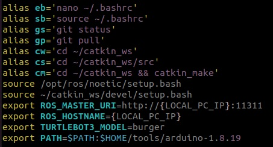
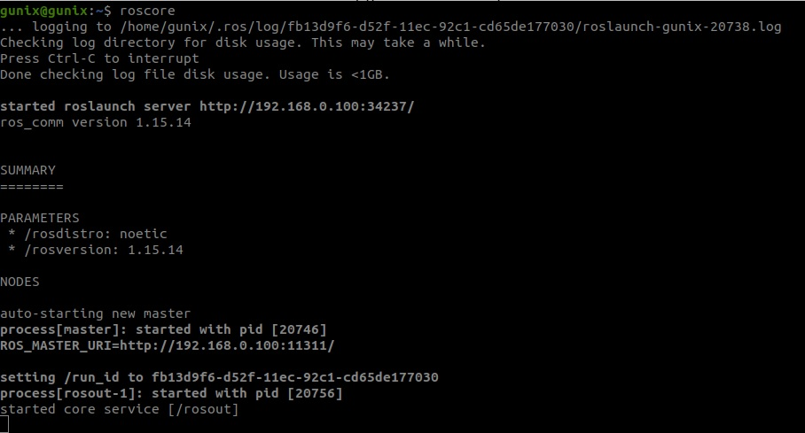
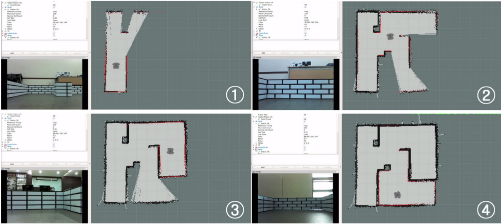
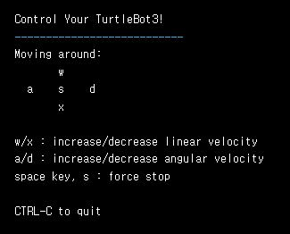
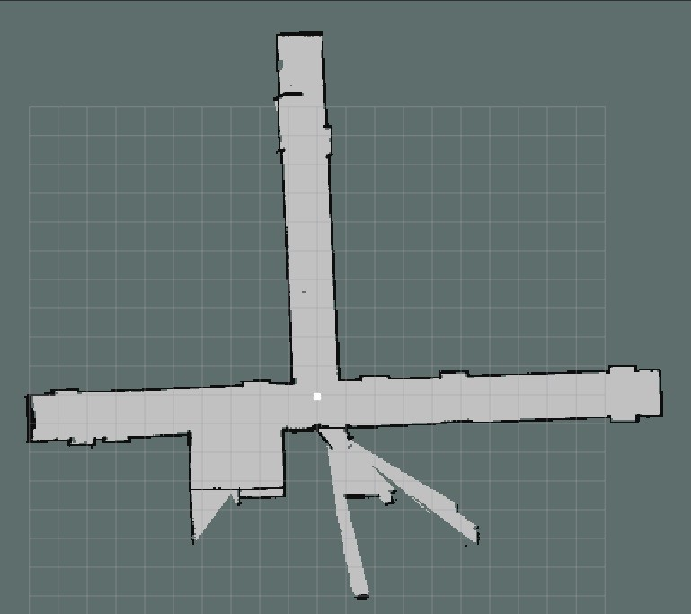

# Robot Server Application
## 로봇 서버 어플리캐이션

## 로봇 서버 구성 및 설치

* 서버에 "Ubuntu 20.04 LTS Desktop" 을 설치한다. (https://releases.ubuntu.com/20.04/)

* ROS 설치
``` bash
# ROS noetic버전 설치
$ sudo apt update
$ sudo apt upgrade
$ wget https://raw.githubusercontent.com/ROBOTIS-GIT/robotis_tools/master/install_ros_noetic.sh
$ chmod 755 ./install_ros_noetic.sh 
$ bash ./install_ros_noetic.sh

# ROS 의존성 패키지 설치
$ sudo apt-get install ros-noetic-joy ros-noetic-teleop-twist-joy \
  ros-noetic-teleop-twist-keyboard ros-noetic-laser-proc \
  ros-noetic-rgbd-launch ros-noetic-rosserial-arduino \
  ros-noetic-rosserial-python ros-noetic-rosserial-client \
  ros-noetic-rosserial-msgs ros-noetic-amcl ros-noetic-map-server \
  ros-noetic-move-base ros-noetic-urdf ros-noetic-xacro \
  ros-noetic-compressed-image-transport ros-noetic-rqt* ros-noetic-rviz \
  ros-noetic-gmapping ros-noetic-navigation ros-noetic-interactive-markers

# Turtlebot3 패키지 설치
$ sudo apt install ros-noetic-dynamixel-sdk
$ sudo apt install ros-noetic-turtlebot3-msgs
$ sudo apt install ros-noetic-turtlebot3
```

* `vim .bashrc` 설정 **( {LOCAL_PC_IP}: server ip )** <br>


`$ roscore` 입력 (종료 하지 않고 아래 내용을 진행하는 것이 좋습니다.)

아래 예시와 같이 나오면 성공<br>


## Mapping
> **Mapping 이란?** <br>
> Lidar 센서로 임의의 공간에서 현재 위치를 추정하여 지도를 그리는 기술인 SLAM(Simultaneous Localization and Mapping) 기술을 활용하여 로봇이 활동 할 수 있는 지도를 그리는 것을 Mapping 이라고 한다.

Mapping 아래 예시처럼 진행 된다.<br>


### _Mapping 방법_

```bash
# 로봇을 원격으로 움직일 수 있는 노드 실행
$ roslaunch turtlebot3_teleop turtlebot3_teleop_key.launch
```
아래와 같이 나오면 성공<br>


> 입력시 <br>
> w - 전진 <br>
> a - 왼쪽으로 회전 <br>
> d - 오른쪽으로 회전<br>
> x - 후진 <br>
> s - 정지 <br>


```bash
# slam 노드 실행
$ roslaunch turtlebot3_slam turtlebot3_slam.launch slam_methods:=gmapping
or
$ roslaunch turtlebot3_slam turtlebot3_slam.launch slam_methods:=cartographer #추천

# 이후 teleop 노드의 입력을 통해 로봇을 움직이면서 원하는 만큼의 맵을 만들면 됩니다.

# map을 다 그렸다면 저장
$ rosrun map_server map_saver -f ~/{map_file_name}
```

`~/` 에 `{map_file_name}.pgm` 과 `{map_file_name}.yaml` 파일이 생성 됩니다.

생성한 map<br>



## Navigation (action)